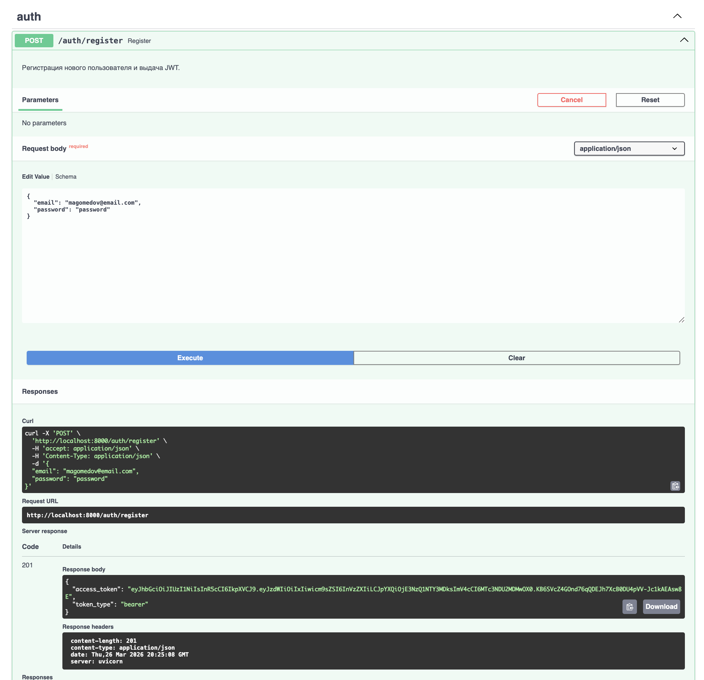
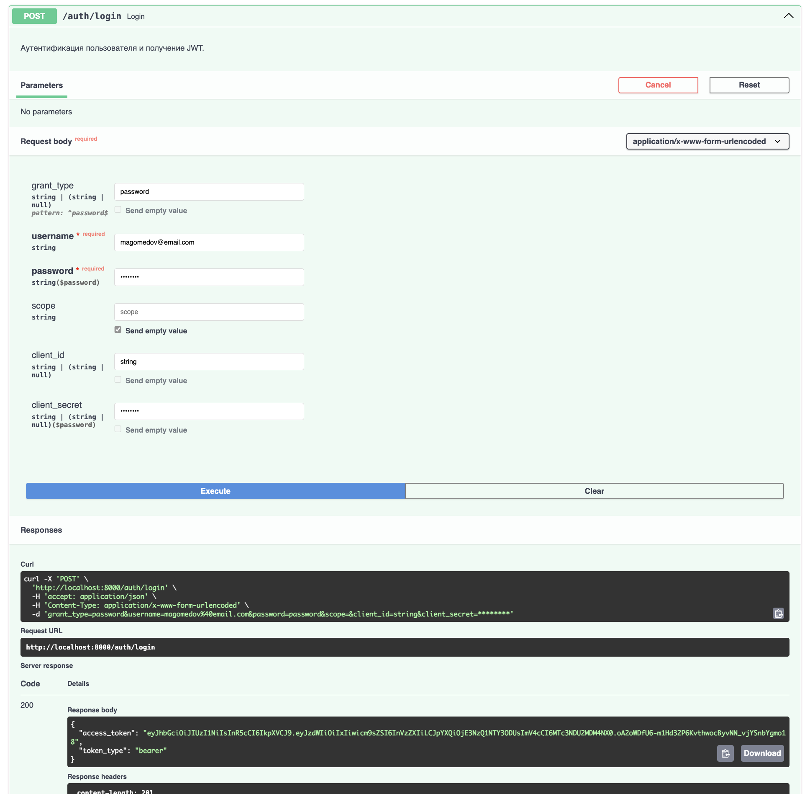
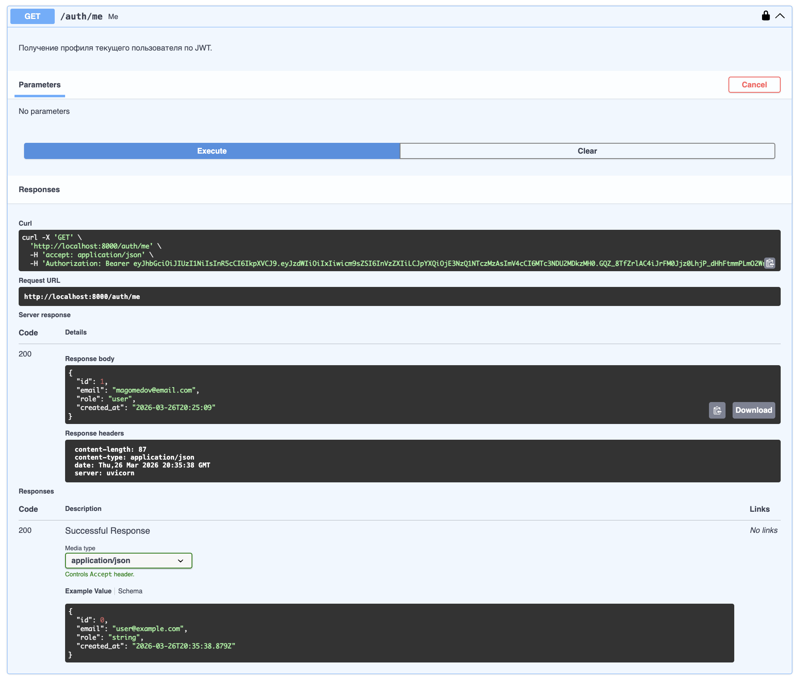
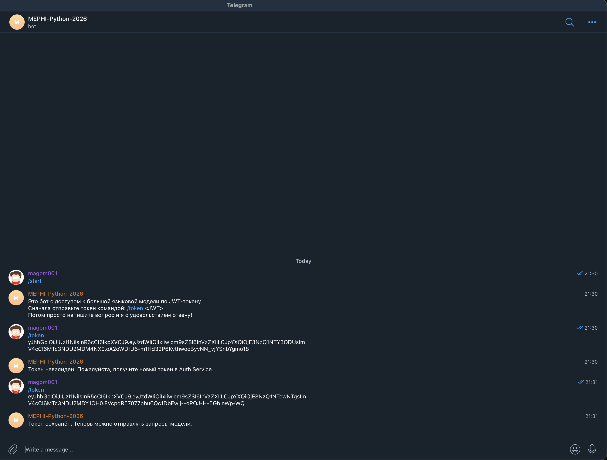
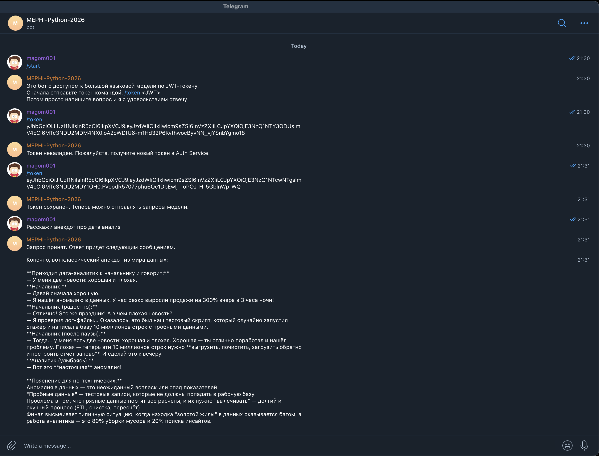
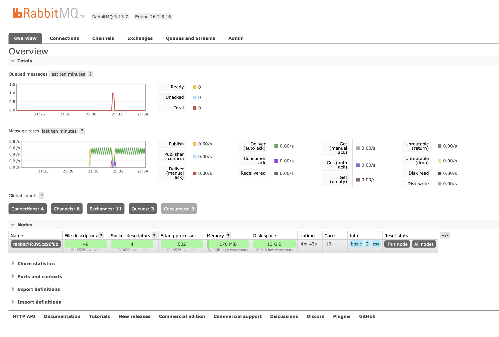

# Двухсервисная система LLM-консультаций

## Архитектура

Система построена по принципу разделения ответственности и состоит из двух логически и технически независимых сервисов, связанных только через JWT-токены. Auth Service отвечает исключительно за управление пользователями и выпуск токенов. Bot Service предоставляет функциональность LLM-консультаций через Telegram-бота и не знает ничего о пользователях, паролях и механизмах регистрации — он доверяет только корректно подписанному и не истёкшему JWT.

Запросы к LLM не выполняются напрямую в Telegram-хэндлерах. Вместо этого Bot Service публикует задачу в очередь RabbitMQ, которую затем обрабатывает Celery-воркер. Это гарантирует, что бот остаётся отзывчивым, а длительные операции не блокируют обработку новых сообщений.

## Назначение сервисов

### Auth Service (FastAPI)

Веб-API для управления пользователями и выпуска JWT-токенов. Swagger UI доступен по адресу `http://localhost:8000/docs`.

| Эндпоинт | Метод | Описание |
|-----------|-------|----------|
| `/auth/register` | POST | Регистрация пользователя (email + password). Возвращает JWT. |
| `/auth/login` | POST | Вход по email и паролю (OAuth2 form-data). Возвращает JWT. |
| `/auth/me` | GET | Профиль текущего пользователя по JWT из заголовка Authorization. |
| `/health` | GET | Проверка работоспособности сервиса. |

- JWT содержит поля `sub` (id пользователя), `role`, `iat`, `exp`
- Пароли хранятся только в виде bcrypt-хеша
- База данных — SQLite (aiosqlite + SQLAlchemy async)
- Это единственное место, где создаются и выпускаются токены

### Bot Service (aiogram + Celery)

Telegram-бот, защищённый JWT-аутентификацией. Не содержит логики регистрации и логина, не хранит пользователей, не обращается к базе Auth Service.

- Принимает JWT через команду `/token <JWT>`, валидирует и сохраняет в Redis
- При получении текстового сообщения проверяет наличие и валидность JWT
- Отправляет задачу в RabbitMQ через Celery (`llm_request.delay(...)`)
- Celery worker обрабатывает задачу: вызывает OpenRouter API и отправляет ответ пользователю через Telegram Bot API

### Инфраструктурные компоненты

| Компонент | Роль |
|-----------|------|
| **RabbitMQ** | Брокер задач Celery. Принимает задачи от бота, передаёт воркеру. |
| **Redis** | Backend результатов Celery + хранилище JWT-токенов по Telegram user_id. |
| **Celery Worker** | Обрабатывает LLM-запросы асинхронно через OpenRouter API. |

## Сценарий работы

1. Пользователь регистрируется в Auth Service через Swagger UI (`http://localhost:8000/docs`), указывая email в формате `surname@email.com` и пароль
2. При успешной регистрации (или логине) Auth Service возвращает JWT-токен
3. Пользователь отправляет боту в Telegram команду `/start` — бот приветствует и описывает порядок работы
4. Пользователь отправляет боту команду `/token <JWT>` — бот валидирует подпись и срок действия токена, при успехе сохраняет его в Redis под ключом `token:<telegram_user_id>`
5. Пользователь отправляет боту текстовый вопрос — бот проверяет наличие и валидность JWT в Redis, публикует задачу `llm_request` в RabbitMQ
6. Бот отвечает пользователю: «Запрос принят. Ответ придёт следующим сообщением.»
7. Celery worker забирает задачу из очереди, отправляет запрос к OpenRouter API
8. Celery worker получает ответ от LLM и отправляет его пользователю через Telegram Bot API
9. Если токен отсутствует, невалиден или истёк — бот отказывает в доступе и предлагает авторизоваться через Auth Service

## Запуск проекта

### Предварительные требования

- [Docker](https://docs.docker.com/get-docker/) и Docker Compose
- [uv](https://docs.astral.sh/uv/) (для локального запуска тестов)
- Telegram-бот, созданный через [@BotFather](https://t.me/BotFather)
- API-ключ [OpenRouter](https://openrouter.ai/)

### 1. Клонирование репозитория

```bash
git clone <URL_РЕПОЗИТОРИЯ>
cd solution
```

### 2. Настройка переменных окружения

Скопируйте файлы-примеры и заполните секреты:

```bash
cp auth_service/.env.example auth_service/.env
cp bot_service/.env.example bot_service/.env
```

Отредактируйте файлы `.env`:

**auth_service/.env** — задайте `JWT_SECRET` (произвольная длинная строка):
```
JWT_SECRET=ваш_секретный_ключ
```

**bot_service/.env** — задайте три обязательных параметра:
```
TELEGRAM_BOT_TOKEN=токен_от_BotFather
JWT_SECRET=тот_же_секрет_что_и_в_auth_service
OPENROUTER_API_KEY=ваш_ключ_openrouter
```

> **Важно:** `JWT_SECRET` должен совпадать в обоих сервисах — иначе Bot Service не сможет валидировать токены, выданные Auth Service.

### 3. Запуск через Docker Compose

```bash
docker compose up --build
```

После запуска будут доступны:

| Сервис | URL |
|--------|-----|
| Auth Service (Swagger UI) | http://localhost:8000/docs |
| RabbitMQ Management | http://localhost:15672 (guest / guest) |
| Bot Service Health | http://localhost:8001/health |

### 4. Остановка

```bash
docker compose down
```

## Тестирование и линтер

Тесты работают **локально без Docker, Redis и RabbitMQ** — все внешние зависимости мокаются.

### Auth Service

```bash
cd auth_service
uv sync
uv run ruff check app/ tests/
uv run pytest -v
```

**Модульные тесты:**
- Хеширование паролей (bcrypt): хеш не равен паролю, верификация правильного/неправильного пароля
- JWT: создание токена, декодирование, проверка полей `sub`, `role`, `iat`, `exp`

**Интеграционные тесты** (in-memory SQLite + httpx ASGITransport):
- Полный поток: register → login → me
- Негативные сценарии: дубль email (409), неверный пароль (401), отсутствие/невалидность токена (401)

### Bot Service

```bash
cd bot_service
uv sync
uv run ruff check app/ tests/
uv run pytest -v
```

**Модульные тесты:**
- Валидация валидного, невалидного, просроченного JWT и токена без `sub`

**Мок-тесты** (fakeredis + pytest-mock):
- Сохранение валидного токена через `/token`, отклонение невалидного
- Отказ при отсутствии токена в Redis
- Вызов `llm_request.delay(...)` при валидном токене
- Отказ при истёкшем токене

**Интеграционные тесты** (respx):
- Клиент OpenRouter: успешный ответ, ошибка API, некорректный формат ответа

## Скриншоты

### Swagger Auth Service

#### Регистрация пользователя (POST /auth/register)



#### Логин (POST /auth/login)



#### Профиль пользователя (GET /auth/me)



### Telegram-бот

#### Отправка JWT-токена боту



#### Запрос к LLM и получение ответа



### RabbitMQ

#### Интерфейс управления — активные очереди и consumers


